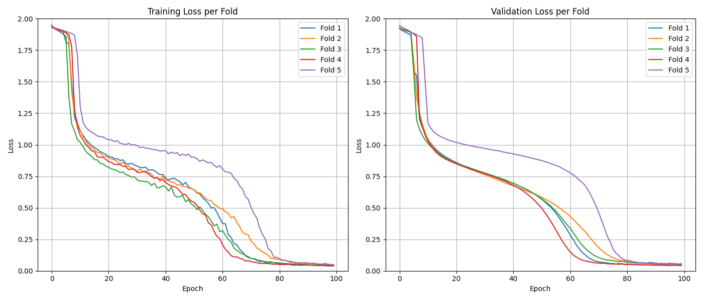
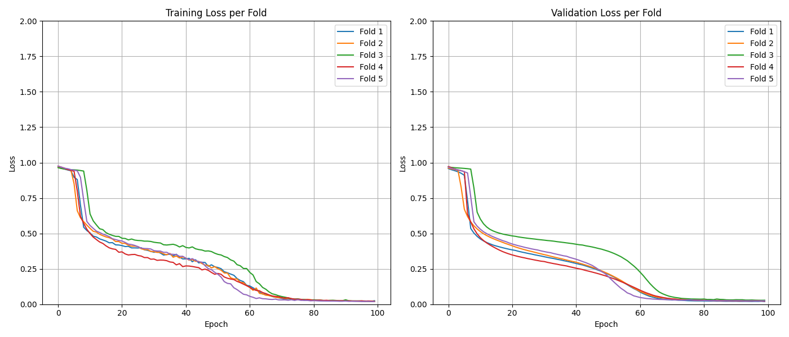

# PAULow: Patch-based Attention U-Net for Low-resource learning

Often, researchers would seek for a validated model available online and fine-tune it to meet their segmentation requirements. However, the established fine-tuning approach may involve online training or computationally intensive offline training. To address this, we propose an offline training pipeline requiring only tens of samples that are morphologically distinct from pre-training data. Our method improves image segmentation performance by 32.60% and 35.62% over Stardist and Cellpose, respectively, using the same amount of training samples without the need of large-scale pre-training.

(Currently supporting: .tif, .tiff) (Capable of handling stacked images)

## Network Architecture:
Our network architecture is depicted in **Figure 1.** We adopted the Attention U-Net structure (Oktay et al., 2018). To maximize the utility of the dataset, we propose to apply a patch-based approach (Ullah et al., 2023). We further propose a threshold-based dynamic loss function to address severe foreground-background imbalance in the cropped dataset while being able to keep all patches in training (see section **Dynamic loss Function Selection Method**).

<p align="center">
  
  <br>
  <b>Figure 1.</b> Overview of the proposed model architecture.
</p>

## Dynamic Loss Function Selection Method:
To address the foreground-background imbalance in the cropped dataset while retaining all training patches, we proposed an adaptive, dynamic, threshold-based loss function strategy (see **Figure 2.**). Predicted masks were categorized into three types: background patches, small ROI patches, and large ROI patches. A patch was classified as a small ROI patch if the predicted foreground area was less than 6.25% of the patch. The overall loss framework combined three loss functions: Binary Cross-Entropy (BCE) loss, Tversky loss, and Focal Tversky loss. The loss function changes dynamically for every predicted image. This method **stabalized training while preventing model hallucinations** (false positives/false negatives) during training and inference. The trained model is also **able to identify foreground and background patches without the need of a classifier head**. Furthermore, the three loss functions can also be changed to adapt to user's specific task. 

<p align="center">
  
  <br>
  <b>Figure 2.</b> The design of the proposed dynamic loss function selection method.
</p>

The proposed dynamic loss function selection method was originally designed so that the loss starts from 2.0 and coverges to 0. The loss curve may display a two plateau convergence (See **Figure 3**). The same 2-plateau trend can also be seen if we strictly add weightings so that the maximum loss is 1.0 (**Figure 4**). The dataset used for this is the BraTS 2020 dataset, using the same patch-based preprocessing strategy with 5 fold CV. The actual effect/mathemathical meaning behind this is yet to be discovered. 

<table align="center">
  <tr>
    <td align="center">
      <br>
      <b>Figure 3.</b> The loss curve when maximum loss = 2.0 
    </td>
    <td align="center">
      <br>
      <b>Figure 4.</b> The loss curve when maximum loss = 1.0.
    </td>
  </tr>
</table>

See the **[full Poster at MIDL 2025 here](./assets/MIDL_2025_Poster_KaiLinChen.pdf)** for dataset description and results analyses.

## Installation
1. Download python version 3.12.4

```bash
https://www.python.org/downloads/release/python-3124/
```

2. Install Libraries on terminal

    **Windows** : Press Windows + R, Type cmd and hit Enter

    **macOS** : Press Command (⌘) + Space to open Spotlight Search, Type Terminal and press Enter

    **Linux** : Press Ctrl + Alt + T

    and run this command:

```bash
pip install numpy opencv-python matplotlib imageio tifffile pillow torch torchvision scikit-learn tqdm
```

if you have a GPU, uninstall torch using this command:

```bash
pip uninstall torch torchvision torchaudio
```

and install this version of torch to use GPU instead:

```bash
pip install torch torchvision torchaudio --index-url https://download.pytorch.org/whl/cu121
```

3. Run directory_setup.py to set up folder structures

## Model Training
1. "COPY" images to Train_Model/TRAINING_IMAGES and masks to Train_Model/TRAINING_MASKS
2. Run train.model.py, wait until training is completed. Best model(Highest Dicescore) will be saved at: Use_Model/saved_models as a .pth file. 

## Use Saved Model
1. "COPY" images to Use_Model/INPUT_IMAGES
2. Run use_model.py and follow the prompts on terminal. Segmented Masks can be seen in Use_Model/OUTPUT_MASKS.

## Fine-tune Saved Model
1. "COPY" images to Finetune_Model/INPUT_IMAGES and masks to Finetune_Model/INPUT_MASKS
2. Run finetune_model.py and follow the prompts on terminal. Fine-tuned models will be saved in Use_Model/saved_models with the name of {ORIGINAL_NAME}_finetuned.pth. To use this finetuned_model, run use_model and follow the prompts.

## **WARNING** 
   **To prevent data from different datasets from being mixed together, train_model.py will automatically delete all images in Train_Model/TRAINING_IMAGES and Train_Model/TRAINING_MASKS.**
   
   **Please copy your dataset into these folders before training to ensure that your original dataset remains intact.**
   
   **Similarly, use_model.py will delete all images in Use_Model/INPUT_IMAGES to avoid segmenting previously used inputs.**
